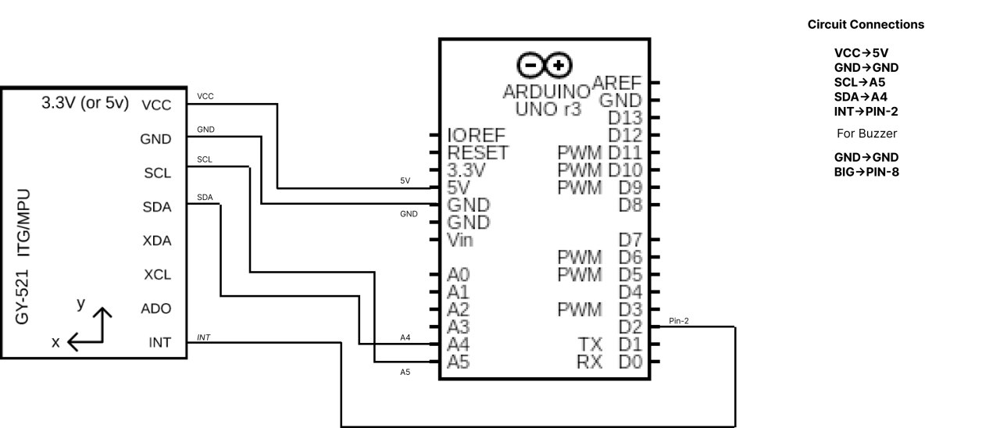
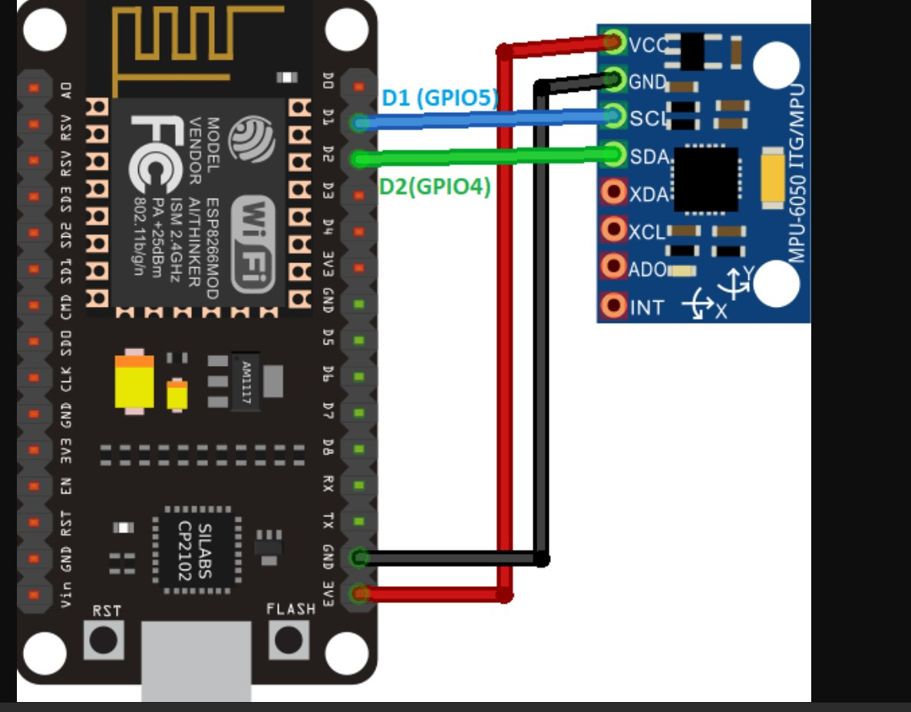

# SafeStep: Early Fall Prediction For Senior Citizens with IoT

**Table of Contents:**
- [Description](#description)
- [Features](#features)
- [Usage](#usage)
- - [Circuits](#circuits)
  - [Arduino Uno and MPU](#arduino-uno-and-mpu)
  - [ESP8266 and MPU6050](#esp8266-and-mpu6050)
- [Models](#models)
- [Contributing](#contributing)
- [License](#license)

---

## Description

SafeStep is an innovative IoT project focused on enhancing the safety of senior citizens by predicting early falls using real-time movement data. This repository contains the codes, Python scripts, and models required for implementing the project. The system not only detects falls but also deploys advanced prevention mechanisms, including an alarm system and an inflating jacket, to reduce the impact of falls and provide rapid assistance.

The project encompasses the following components:
- IoT device that captures real-time movement data
- Machine Learning (ML) model for fall prediction
- Alarm system activated upon identifying fall characteristics
- Inflating jacket as a preventive measure
- Call for assistance to ensure quick response in case of falls

## Features

- Real-time movement data collection and analysis
- ML model trained for early fall prediction
- Alarm system activated upon identifying fall patterns
- Inflating jacket designed to minimize fall impact
- IoT device for movement tracking and preventive assistance

## Usage

1. **Data Collection**: Use the provided scripts to gather movement data from the IoT device and store it for analysis.

2. **Model Training**: Train the fall prediction ML model using the provided dataset and code. Fine-tune the model parameters as needed.

3. **Deployment**: Deploy the trained model onto the IoT device to enable real-time fall prediction.

4. **Circuit Implementation**: Set up the Arduino Uno or ESP8266 circuit as described in the circuit sections below.

5. **Testing**: Test the fall prediction, alarm system, and inflating jacket mechanisms with simulated falls and real-world scenarios.

## Circuits

### Arduino Uno and MPU

To implement the circuit using Arduino Uno and MPU, follow the schematic provided.

### ESP8266 and MPU6050

For wireless data collection, use the ESP8266 module along with the MPU6050 sensor. Build the circuit according to the given diagram.

## Models

This repository includes pretrained models for fall prediction. However, you can fine-tune the models based on your data for improved accuracy.

## Contributing

Contributions to SafeStep are welcome! If you have any improvements or suggestions, feel free to create a pull request.
